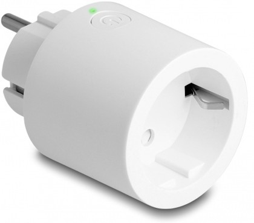

# 2024_2025 - Diplomski projekt
### Komunikacija i kolaboracija udaljenih korisnika primjenom tehnologija virtualne i proširene stvarnosti
Članovi tima: Marin Petric, Robert Kunštek, Eugen Preglej, Branimir Tomeljak, Anteo Vukasović

Upute za korištenje:  
potrebno: Quest 2 (za VR), Quest 3 (za AR), pametna utičnica (Delock WLAN Power Socket Switch MQTT with energy monitoring), lampa  
  
aplikacija ima dva korisnika, VR i AR korisnika, te je namijenjena da se koristi na dva različita uređaja istovremeno. VR je testiran da radi na Oculus Quest 2 te AR da radi na Oculus Quest 3, ali bi VR trebao raditi i na Quest 3.  

Upute za spajanje pametne utičnice na mrežu ako nije već spojena:
- Uključiti utičnicu u struju te 4 puta brzo pritisnuti gumb
- Računalom se spojiti na Wi-Fi mrežu "delock-3530"
- Ako se ne otvori browser popup -> otiči na `http://192.168.4.1/`
- Ispuniti samo prve dvije kućice (ime i lozinka Wi-Fi mreže na koju želimo da se pametna utičnica spoji), ostale izbrisati
- Spojiti računalo na mrežu na koju smo spojili utičnicu te sačekati do 2-3 minute
- Provjeriti radi li utičnica na `http://delock-3530.local/`

napomena: kako je bilo problema s DNS razlučivanjem .local adresa na Quest 3 (utičnica je napravljena tako da se na nju spaja preko adrese `http://delock-3530.local`), u buildanim verzijama je hardkodirana IP adresa pametne utičnice. Ako se ta adresa promijeni potrebno ju je promijeniti unutar Unity Editora u prefabu `Lamp System` pod `Lamp System -> Lamp Manager [Switch Control skripta] -> Base Url` te ponovno buildati projekt (trebalo bi biti dovoljno rebuildati samo AR aplikaciju). Novu IP adresu pametne utičnice na Windowsu je najlakše pronaći pomoću konzolne naredbe `nslookup delock-3530.local` ili `ping delock-3530.local`.
